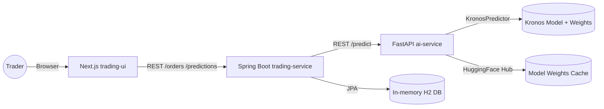

# Broker Trading Platform

An open-source trading sandbox that demonstrates how to operationalise **Kronos** – the Tsinghua University foundation model for financial markets (<https://github.com/shiyu-coder/Kronos>). The platform couples Kronos-powered forecasts with a Spring Boot order engine and a modern Next.js UI, giving you an end-to-end playground for research, prototyping, and future broker integration.

## What You Can Do Today

- Generate 5-day BUY/SELL/HOLD signals with the Kronos model.
- Create demo buy/sell orders with portfolio-level buying power and inventory rules.
- Inspect predictions, orders, and signals in a single web experience optimized for rapid experimentation.

## Current Architecture



## Quick Start

```bash
docker compose up --build
```

Environment highlights:

| Variable                      | Purpose                                   | Default                           |
| ----------------------------- | ----------------------------------------- | --------------------------------- |
| `KRONOS_DEVICE`               | Set to `cpu`, `cuda`, or `cuda:0`         | `cpu`                             |
| `KRONOS_MODEL_ID`             | Hugging Face model ID for Kronos          | `NeoQuasar/Kronos-small`          |
| `KRONOS_TOKENIZER_ID`         | Hugging Face tokenizer ID                 | `NeoQuasar/Kronos-Tokenizer-base` |
| `PREDICTION_SERVICE_BASE_URL` | AI service URL used by Spring Boot        | `http://localhost:5001`           |
| `NEXT_PUBLIC_API_BASE_URL`    | Frontend base URL for the trading service | `http://localhost:8080`           |

To persist Kronos weights across rebuilds, mount a cache directory:

```yaml
services:
  ai-service:
    volumes:
      - ./cache/huggingface:/root/.cache/huggingface
```

### Run Without Docker

Start each service in its own terminal once dependencies are installed:

```bash
# FastAPI (requires Python 3.12+)
cd ai-service
python -m venv .venv && source .venv/bin/activate
pip install -r requirements.txt
uvicorn main:app --host 0.0.0.0 --port 5001

# Spring Boot API
cd ..
./mvnw spring-boot:run

# Next.js UI (Node 18+)
cd trading-ui
npm install
npm run dev -- --port 3000
```

**Note:** The platform uses an in-memory H2 database by default. All data (orders, portfolios, inventory) is lost when the Spring Boot service restarts.

## Historical Market Data for Kronos (what to plug in)

Right now, the Kronos predictor in `ai-service/kronos_integration/predictor.py` uses synthetic price bars purely to demonstrate end-to-end wiring. In production you should fetch real historical OHLCV data for the requested ISIN and pass it to the predictor. At minimum you need a DataFrame with columns:

- `open`, `high`, `low`, `close`, `volume` (optionally `amount`)
- A matching timestamp index (5-minute bars are assumed in the sample)

Where should this data come from?
- Your own market data store (PostgreSQL, TimescaleDB, ClickHouse, etc.)
- A vendor API (e.g., Polygon.io, Tiingo, Alpha Vantage) cached into your DB
- For research, any CSV/Parquet you maintain for the instruments you support

See `ref/Kronos-demo/update_predictions.py` for a simple example that loads a local dataset and runs a prediction pipeline; we follow a similar shape. To wire this into our service, replace the placeholder synthetic block in `kronos_integration/predictor.py` with a function that queries your data store by ISIN, builds `x_df` (historical lookback rows), and constructs `x_timestamp`/`y_timestamp` ranges to match the desired prediction horizon.

Pseudo-contract for that function:
- input: `isin: str`, `lookback: int`, `pred_len: int`
- output: `(x_df: pd.DataFrame[open,high,low,close,volume,amount], x_timestamp: DatetimeIndex, y_timestamp: DatetimeIndex)`

Once you have it, inject it into the predictor and remove the synthetic data code path.

## Connecting to Your Own Trading Account

1. Keep the Kronos inference service running (Docker or host Python) so forecasts remain available.
2. Extend the Spring Boot trading service with real broker adapters while preserving its existing REST surface for the UI.
3. Carefully separate **simulation** and **live** modes; require explicit configuration before forwarding orders to an exchange.
4. Store exchange credentials in environment variables or a secrets manager—never commit keys to the repository.
5. Add monitoring (latency/error metrics) and rollback pathways so you can fall back to simulation when the exchange API degrades.

## TODO

You can connect this project to your own Binance account by following the official developer guidance (<https://developers.binance.com/en>):

1. **Pick the environment** – start with Binance Testnet; switch to Production only after end-to-end validation.
2. **Create API keys** – log into the Binance dashboard, enable trading permissions, and record the API key/secret securely (e.g., AWS Secrets Manager, HashiCorp Vault).
3. **Understand signing** – Binance REST requests require HMAC SHA256 signatures and timestamps; use the official SDK or sign requests server-side in Spring Boot.
4. **Use REST + WebSocket APIs** – REST for order placement/account queries, WebSockets for live fills and market data; handle automatic reconnects and listen-key heartbeats.
5. **Implement rate limiting** – respect Binance weight limits, back off when `429` responses occur, and log usage for auditing.
6. **Add risk controls** – enforce portfolio limits, throttle strategy execution, and maintain an audit log of all outbound orders.
7. **Secrets injection** – expose keys to containers via variables such as `BINANCE_API_KEY` & `BINANCE_API_SECRET`; rotate them regularly.
8. **Test extensively** – run integration tests and dry runs against Testnet, then enable production access behind a feature flag for manual confirmation.

## License

MIT
